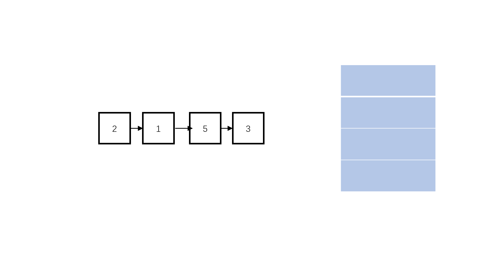

[牛客网原题链接](https://www.nowcoder.com/practice/d0267f7f55b3412ba93bd35cfa8e8035?tpId=13&&tqId=11156&rp=1&ru=/ta/coding-interviews&qru=/ta/coding-interviews/question-ranking)

#### **题目描述**

输入一个链表的头节点，按链表从尾到头的顺序返回每个节点的值（用数组返回）。

如输入{1,2,3}的链表如下图:


返回一个数组为[3,2,1]

0 <= 链表长度 <= 10000

##### 示例1

```
输入：{1,2,3}
返回值：[3,2,1]
```

##### 示例2

```
输入：{67,0,24,58}
返回值：[58,24,0,67]
```


##### 方法一：递归（推荐使用）

**知识点：递归**

递归是一个过程或函数在其定义或说明中有直接或间接调用自身的一种方法，它通常把一个大型复杂的问题层层转化为一个与原问题相似的规模较小的问题来求解。因此递归过程，最重要的就是查看能不能讲原本的问题分解为更小的子问题，这是使用递归的关键。

**思路：**

我们都知道链表无法逆序访问，那肯定无法直接遍历链表得到从尾到头的逆序结果。但是我们都知道递归是到达底层后才会往上回溯，因此我们可以考虑递归遍历链表，因此三段式如下：

- **终止条件：** 递归进入链表尾，即节点为空节点时结束递归。
- **返回值：** 每次返回子问题之后的全部输出。
- **本级任务：** 每级子任务递归地进入下一级，等下一级的子问题输出数组返回时，将自己的节点值添加在数组末尾。

**具体做法：**

- step 1：从表头开始往后递归进入每一个节点。
- step 2：遇到尾节点后开始返回，每次返回依次添加一个值进入输出数组。
- step 3：直到递归返回表头。

```c++
class Solution {
public:
    //递归函数
    void recursion(ListNode* head, vector<int>& res){ 
        if(head != NULL){
            //先往链表深处遍历
            recursion(head->next, res); 
            //再填充到数组就是逆序
            res.push_back(head->val); 
        }
    }
    vector<int> printListFromTailToHead(ListNode* head) {
        vector<int> res;
        //递归函数打印
        recursion(head, res); 
        return res;
    }
};
```

**复杂度分析：**

- 时间复杂度：O(n)，其中n为链表长度，递归遍历一次链表
- 空间复杂度：O(n)，递归栈的最大空间为链表长度


##### 方法二：栈（扩展思路）

**知识点：栈**

栈是一种仅支持在表尾进行插入和删除操作的线性表，这一端被称为栈顶，另一端被称为栈底。元素入栈指的是把新元素放到栈顶元素的上面，使之成为新的栈顶元素；元素出栈指的是从一个栈删除元素又称作出栈或退栈，它是把栈顶元素删除掉，使其相邻的元素成为新的栈顶元素。

**思路：**

递归的思想也可以用栈实现，因为栈是先进后出的，符合逆序的特点，递归本质上就是用栈实现的。

**具体做法：**

- step 1：我们可以顺序遍历链表，将链表的值push到栈中。
- step 2：然后再依次弹出栈中的元素，加入到数组中，即可实现链表逆序。

**图示：**



```c++
class Solution {
public:
    vector<int> printListFromTailToHead(ListNode* head) {
        vector<int> res;
        stack<int> s;
        //正序输出链表到栈中
        while(head != NULL){ 
            s.push(head->val);
            head = head->next;
        }
        //输出栈中元素到数组中
        while(!s.empty()){ 
            res.push_back(s.top());
            s.pop();
        }
        return res;
    }
};
```

**复杂度分析：**

- 时间复杂度：O(n)，遍历链表是一个O(n)，弹空一个栈需要O(n)
- 空间复杂度：O(n)，栈空间最大长度是链表的长度n

