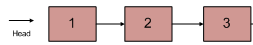

[牛客网原题链接](https://www.nowcoder.com/practice/d0267f7f55b3412ba93bd35cfa8e8035?tpId=13&&tqId=11156&rp=1&ru=/ta/coding-interviews&qru=/ta/coding-interviews/question-ranking)

#### **题目描述**

输入一个链表的头节点，按链表从尾到头的顺序返回每个节点的值（用数组返回）。

如输入{1,2,3}的链表如下图:



返回一个数组为[3,2,1]

0 <= 链表长度 <= 10000

##### 示例1

```
输入：{1,2,3}
返回值：[3,2,1]
```

##### 示例2

```
输入：{67,0,24,58}
返回值：[58,24,0,67]
```

#### **1、从前向后保存，然后reverse不就可以了吗。**

运行时间：3ms 占用内存：504k

```cpp
vector<int> printListFromTailToHead(ListNode* head) {
    if( head == nullptr) return vector<int>();

    vector<int> result;
    while(head != nullptr){
        result.push_back(head->val);
        head = head->next;
    }

    reverse(result.begin(),result.end());
    return result;

}
```

#### **2、不用reverse，返回一个逆序也行**

运行时间：2ms 占用内存：480k

```cpp
vector<int> printListFromTailToHead(ListNode* head) {
    if( head == nullptr) return vector<int>();

    vector<int> result;
    while(head != nullptr){
        result.push_back(head->val);
        head = head->next;
    }

    // reverse(result.begin(),result.end());
    return vector<int>(result.rbegin(),result.rend());

}
```