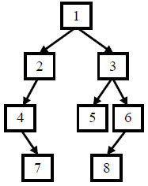

[牛客网原题链接](https://www.nowcoder.com/practice/8a19cbe657394eeaac2f6ea9b0f6fcf6?tpId=13&&tqId=11157&rp=1&ru=/ta/coding-interviews&qru=/ta/coding-interviews/question-ranking)

#### 题目描述

给定节点数为 n 的二叉树的前序遍历和中序遍历结果，请重建出该二叉树并返回它的头结点。

例如输入前序遍历序列{1,2,4,7,3,5,6,8}和中序遍历序列{4,7,2,1,5,3,8,6}，则重建出如下图所示。



**提示**:

1. vin.length == pre.length

2. pre 和 vin 均无重复元素

3. vin出现的元素均出现在 pre里

4. 只需要返回根结点，系统会自动输出整颗树做答案对比

数据范围：n≤2000，节点的值−10000≤val≤10000

要求：空间复杂度 O(n)，时间复杂度 O(n)

##### 示例1

```
输入：[1,2,4,7,3,5,6,8],[4,7,2,1,5,3,8,6]
返回值：{1,2,3,4,#,5,6,#,7,#,#,8}
说明：返回根节点，系统会输出整颗二叉树对比结果，重建结果如题面图示    
```

##### 示例2

```
输入：[1],[1]
返回值：{1}
```

##### 示例3

```
输入：[1,2,3,4,5,6,7],[3,2,4,1,6,5,7]
返回值：{1,2,5,3,4,6,7}
```

#### 题解

##### 题目的主要信息：

- 根据二叉树的前序遍历序列和中序遍历序列，重建该二叉树，并返回根节点
- 两个遍历都没有重复的元素


二叉树的**前序遍历**：根左右；**中序遍历**：左根右

##### 方法一：递归（推荐使用）

**知识点：二叉树递归**

递归是一个过程或函数在其定义或说明中有直接或间接调用自身的一种方法，它通常把一个大型复杂的问题层层转化为一个与原问题相似的规模较小的问题来求解。因此递归过程，最重要的就是查看能不能讲原本的问题分解为更小的子问题，这是使用递归的关键。

而二叉树的递归，则是将某个节点的左子树、右子树看成一颗完整的树，那么对于子树的访问或者操作就是对于原树的访问或者操作的子问题，因此可以自我调用函数不断进入子树。

**思路：**

对于二叉树的前序遍历，我们知道**前序遍历序列的第一个元素必定是根节点的值**，因为序列没有重复的元素，因此中序遍历中可以找到相同的这个元素，而我们又知道中序遍历中根节点将二叉树分成了左右子树两个部分，如下图所示：


我们可以发现，数字1是根节点，并将二叉树分成了(247)和(3568)两棵子树，而子树的的根也是相应前序序列的首位，比如左子树的根是数字2，右子树的根是数字3，这样我们就可以利用前序遍历序列找子树的根节点，利用中序遍历序列区分每个子树的节点数。

**具体做法：**

- step 1：先根据前序遍历第一个点建立根节点。
- step 2：然后遍历中序遍历找到根节点在数组中的位置。
- step 3：再按照子树的节点数将两个遍历的序列分割成子数组，将子数组送入函数建立子树。
- step 4：直到子树的序列长度为0，结束递归。

```c++
/**
 * Definition for binary tree
 * struct TreeNode {
 *     int val;
 *     TreeNode *left;
 *     TreeNode *right;
 *     TreeNode(int x) : val(x), left(NULL), right(NULL) {}
 * };
 */
class Solution {
public:
    TreeNode* reConstructBinaryTree(vector<int> pre,vector<int> vin) {
        int n = pre.size();
        int m = vin.size();
        //每个遍历都不能为0
        if(n == 0 || m == 0) return NULL;
        //构建根节点
        TreeNode *root = new TreeNode(pre[0]); 
        for(int i = 0; i < vin.size(); i++){
            //找到中序遍历中的前序第一个元素
            if(pre[0] == vin[i]){ 
                //左子树的前序遍历
                vector<int> leftpre(pre.begin() + 1, pre.begin() + i + 1);  
                //左子树的中序遍历
                vector<int> leftvin(vin.begin(), vin.begin() + i); 
                //构建左子树
                root->left = reConstructBinaryTree(leftpre, leftvin); 
                //右子树的前序遍历
                vector<int> rightpre(pre.begin() + i + 1, pre.end()); 
                //右子树的中序遍历
                vector<int> rightvin(vin.begin() + i + 1, vin.end()); 
                //构建右子树
                root->right = reConstructBinaryTree(rightpre, rightvin); 
                break;
            }
        }
        return root;
    }
};
```

**复杂度分析：**

- 时间复杂度：O(n)，其中n为数组长度，即二叉树的节点数，构建每个节点进一次递归，递归中所有的循环加起来一共n次
- 空间复杂度：O(n)，递归栈最大深度不超过n，辅助数组长度也不超过n，重建的二叉树空间属于必要空间，不属于辅助空间